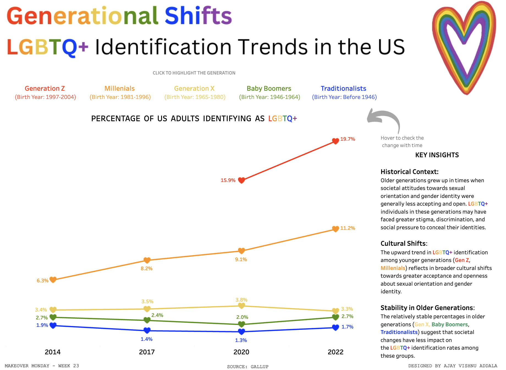

# LGBTQ+ Identification Across Generations

This repository contains the data and Tableau visualization for analyzing the shift in LGBTQ+ identification across different generations in the U.S. from 2014 to 2022. This analysis is part of the Makeover Monday challenge.

## Data

The dataset includes survey data on the share of the U.S. adult population identifying as LGBTQ+ across various generations and years. The generations are defined as follows:

- **Generation Z**: Born 1997-2004
- **Millennials**: Born 1981-1996
- **Generation X**: Born 1965-1980
- **Baby Boomers**: Born 1946-1964
- **Traditionalists**: Born before 1946

## Insights

### Historical Context
Older generations grew up in times when societal attitudes towards sexual orientation and gender identity were generally less accepting and open. LGBTQ+ individuals in these generations may have faced greater stigma, discrimination, and social pressure to conceal their identities.

### Cultural Shifts
The upward trend in LGBTQ+ identification among younger generations (Gen Z, Millennials) reflects broader cultural shifts towards greater acceptance and openness about sexual orientation and gender identity.

### Stability in Older Generations
The relatively stable percentages in older generations (Gen X, Baby Boomers, Traditionalists) suggest that societal changes have less impact on the LGBTQ+ identification rates among these groups.

## Tableau Visualization

You can view the interactive Tableau dashboard on Tableau Public: [LGBTQ+ Identification Across Generations Dashboard](https://public.tableau.com/views/LGBTQidentificationtrendsintheUSMOM2024Week23/PRIDE?:language=en-US&:sid=&:display_count=n&:origin=viz_share_link)

## Snapshot

Below is a snapshot of the dashboard:

## Repository Contents

- Contains the dataset used for the analysis.
- Tableau workbook file.
- Snapshot of the Tableau dashboard.
- Video demo of the dashboard.
